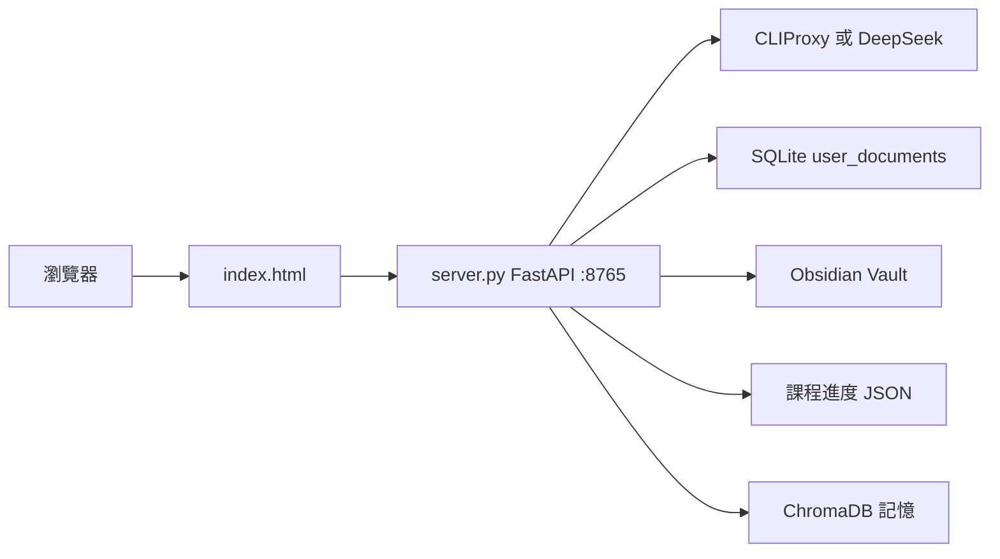

# study-system

「每日一學」——單人使用的每日學習入口。把外部課程排成學習佇列，由 LLM 扮演 Teacher，以蘇格拉底式主動講解加上簡答／申論題帶完一課；結束後把對話逐字稿與筆記寫進 Obsidian Vault，並用 streak、XP（顯示為 NT$ 錢包）、等級、成就、習慣打卡、願望清單維持動力。不是閃卡或間隔重複，也不是考試準備。學的內容是 AI Agent、軟體架構、Build Your Own X、哲學等主題課程。使用者只有一人，無註冊功能。

技術棧：FastAPI · uvicorn · 單檔 HTML／JS（無框架、無 build）· SQLite WAL · ChromaDB / fastembed（選配）· Docker Compose · CLIProxy

## 解決的問題

要把 GitHub 教材與自適應哲學課變成每天能開課、能留下筆記、能看連續學習紀錄的單一入口。預設帳號開機時由 `LOCAL_AUTH_PASSWORD` 同步進 `users.json`，沒有公開註冊。

## 功能

- 登入／登出／session cookie（7 天 TTL，記憶體內 `SESSIONS` dict）。`/api/auth/login`、`/api/auth/me`、`/api/auth/logout`、`/api/auth/verify`（`server.py`）
- 學習佇列：新增／編輯／刪除、今日抽題、直接點佇列進課程。`index.html` 的 `renderQueue()`、`startQueueLesson()`、`pickTodayItem()`
- 課程同步預覽：讀 Hermes 產出的 4 份課程進度 JSON，展開成可加入佇列的章節。`/api/sync-courses`
- Teacher 學習模式（SSE 串流）：注入課程抓取內容、長期記憶、哲學課背景。`/api/chat`（系統提示 `TEACHER_SYSTEM`）
- AI 供應商／模型／推理強度切換（Grok、OpenAI 訂閱走 CLIProxy；DeepSeek 走 API key）。`/api/ai/status`、`AI_PROVIDER_ROUTES`
- 抓取課程網址正文（去 HTML tag，截 10000 字）。`/api/fetch-content`
- 長期記憶檢索（ChromaDB + fastembed `jina-embeddings-v2-base-zh`，collection `hermes_mem0_jina`）。`/api/memory-context`
- 筆記側欄寫入 Obsidian（路徑限制在 Vault 內、必須 `.md`）。`/api/note`
- 課程完成：筆記＋對話逐字稿＋教師總結寫成一份 Markdown。`/api/learn/complete`
- 自適應哲學課：記錄問題／摘要／深度評分，自動推進下一課、維護 user_profile。`/api/philosophy/progress`、`/api/philosophy/complete`
- 課程方向微調，排入待學主題。`/api/curriculum/adjust`
- 中央資料同步（樂觀鎖 revision、多裝置衝突回 409）。`GET/PUT/POST /api/data`
- 遊戲化：streak、NT$／XP、10 級等級、10 個成就、跳過理由日記、每日獎勵防刷。`index.html` 的 `LEVELS`、`ACHIEVEMENTS`
- 習慣打卡與願望清單（用 NT$ 兌換）
- 健康檢查。`/api/health`（回報 SQLite 可讀可寫）
- 主題切換（日／夜）、桌面／手機底部導覽
- UI 皮膚腳本（會就地改寫 `index.html`）。`tools/apply_forest_ui.py`、`tools/apply_anime_css.py`、`tools/restore_v7.py`

佇列是唯一開課入口。Habits 分頁只打卡，不擋今日課程。

## 畫面

單頁 PWA，繁中，手機優先。URL：`http://127.0.0.1:8765/` 或經 Homepage `/study-system`（實際 upstream `/_svc/study-system/`）。需要登入（預設使用者 `pieye`，密碼為環境變數 `LOCAL_AUTH_PASSWORD`）。未登入 API 回 `{"detail":"請先登入"}`。

| 登入 | 說明 |
|---|---|
|  | Session cookie 七天。容器重啟即全數登出。 |

畫面區塊：狀態列（streak、等級／NT$ 進度條）、今日習慣、學習佇列與 Hermes 課程同步、習慣／願望／成就／統計、AI 設定、Teacher 聊天室與右側筆記面板。完課產出 Markdown，含「我的筆記／對話記錄／教師總結」三段，寫入 Obsidian Vault `學習/`。

## 架構



前端：單一檔 `index.html`（約 153 KB，內含 CSS 與約 2900 行 JS，無框架、無 build）。圖示在 `assets/icons`、`icons-v7`、`icons-v10`。後端：`server.py`（FastAPI + uvicorn，約 1720 行，單檔）。`/` 回 `index.html`（no-cache），`/static` 掛整個目錄。

資料流：

1. 使用者登入 → cookie `study_system_session`。
2. `/api/sync-courses` 讀 `$STUDY_DATA_ROOT/{ai-agents-course,awesome-architecture,build-your-own-x,philosophy}-progress.json`（前三者由外部 Hermes 產生；哲學課改讀中央 DB 的 `philosophy` 文件）→ 使用者加入佇列。
3. 開課：前端先呼叫 `/api/fetch-content` 與 `/api/memory-context`，再連同哲學背景塞進 `/api/chat`。後端以 OpenAI 相容 `chat/completions` 串流轉發，`_extract_stream_content()` 濾掉 `reasoning_content` 只留可見文字。
4. 完課：`/api/learn/complete` 寫 `Obsidian Vault/學習/<類別>/<標題>.md`；哲學課再打 `/api/philosophy/complete`；學習狀態整份 JSON 以 `PUT /api/data` + `base_revision` 存進 SQLite。
5. LocalStorage 只作快取。中央 SQLite 為權威。

LLM 三條路由（`AI_PROVIDER_ROUTES`）：`grok`（預設）與 `openai` 經 CLIProxy（`CLIPROXY_BASE`，compose 內 `http://cli-proxy-api:8317/v1`，token 讀 `CLIPROXY_KEY_FILE`）；`deepseek` 直連 `DEEPSEEK_BASE`。anthropic／gemini 尚未接。呼叫 LLM 的只有 `chat()`；`ai_status()` 只探測 `/models`。記憶是本機 ChromaDB（`CHROMA_PATH`），非雲端。未使用 Notion。

## 資料模型／資料處理成果

| 表名／檔案 | 筆數或產物 |
|---|---|
| SQLite `user_documents` | 欄位 `username`、`document_key ∈ {study, philosophy}`、`revision`、`data_json`；單文件上限 4 MB。容器化後目前 0 列（尚未有人登入寫入） |
| `study-system.sqlite3` | 16 KB（2026-09-05 建），WAL 模式 |
| `study-system-users.json` | 1 個帳號 |
| Obsidian `學習/` | 31 個 `.md`，其中 19 份含「對話記錄」（哲學 7、AI Agent 6、技術架構 6）；另有 2 份進度總表與 9 份英文學習手冊（非本系統產出） |

舊版 JSON（`study-system-data.json`、`study-system-users/`、`philosophy-progress.json`）由 `_legacy_document_data()` 在首次讀取時遷移進 DB。

主機 `~/.hermes/home` 目前沒有 `*-progress.json`，也沒有 `mem0/chroma-jina`：`/api/sync-courses` 對前三門課會回 `progress file not found`，`/api/memory-context` 會回 500。實際學習紀錄集中在 2026-08-03 至 08-12（vault 檔案 mtime）。

課程來源：microsoft/ai-agents-for-beginners、study8677/awesome-architecture、codecrafters-io/build-your-own-x、自生成哲學課。

## 自動化

無 cron、無 systemd timer、無 n8n workflow 指向此服務。

唯一自動行為：容器 `restart: unless-stopped` 與 30 秒 healthcheck；啟動時 `lifespan()` 建表並同步預設帳號密碼；前端 `startSyncMonitor()` 定期輪詢同步、`autoCleanupQueue()` 清理佇列。課程進度 JSON 由外部 Hermes 系統產生，非本專案排程。

## 部署與執行

### 埠與 slug

| 項目 | 值 |
|---|---|
| listen | `127.0.0.1:8765` |
| Homepage slug | `/study-system` → 127.0.0.1:8765 |
| PWA origin | `todo.coinpilet.win` |
| 映像 | `study-system:local` |
| 執行時 runtime | compose（舊 `study-system.service` 已 disabled；`infisical-stack@study-system` 存在但可能 inactive） |

### 啟動（2026-09 更新）

密鑰必須經 Infisical 注入。不要直接 `docker compose up`：會把 `${DEEPSEEK_API_KEY}`、`${LOCAL_AUTH_PASSWORD}` 代換成空字串，登入將 fail closed。

```bash
cd /home/pieye/Container/study-system

# 停掉舊的 user unit
systemctl --user disable --now study-system.service 2>/dev/null || true

/home/pieye/Container/scripts/with-infisical study-system -- docker compose up -d
curl -sS http://127.0.0.1:8765/api/health
```

`database.ok=true` 且 `database.writable=true` 才代表中央資料庫可正常使用。`docker compose restart` 不重建容器、保留原環境，是安全的。

主機 published port 只綁 loopback。容器內要用 compose DNS `cli-proxy-api:8317`（加入外部網路 `cliproxyapi_default`）。

本機開發（repo 無 `.venv`；需先 `pip install -r requirements.txt`）：

```bash
# 密鑰仍走 Infisical，不要複製 .env
/home/pieye/Container/scripts/with-infisical study-system -- ./start.sh
```

`start.sh` 會 `source .venv/bin/activate` 後跑 uvicorn `:8765`。

### 路徑（env / mounts）

| 環境變數 | 容器內預設 | 主機掛載 |
|---|---|---|
| `VAULT_ROOT` | `/vault` | `Obsidian Vault` |
| `HERMES_HOME` | `/hermes` | `~/.hermes` |
| `STUDY_DATA_ROOT` | `/hermes/home` | （在 Hermes home 內） |
| `STUDY_DB_PATH` | `/hermes/home/study-system.sqlite3` | 同上 |
| `CHROMA_PATH` | `/hermes/mem0/chroma-jina` | 同上 |
| `CLIPROXY_BASE` | `http://cli-proxy-api:8317/v1` | 加入 `cliproxyapi_default` |
| `CLIPROXY_KEY_FILE` | `/secrets/cliproxy/api_key` | `~/.config/cliproxy/api_key` |

可選 host 檔 `~/.hermes/home/.study-system.env` 在 compose 裡 `required: false`。運行時密鑰以 Infisical 為準。

### Infisical folder 與變數名稱

| 來源 | 名稱 | 說明 |
|---|---|---|
| Infisical `/study-system` | `DEEPSEEK_API_KEY`、`LOCAL_AUTH_PASSWORD` | DeepSeek 與登入密碼 |
| compose／程式 | `STUDY_AI_PROVIDER`、`STUDY_AI_MODEL`、`STUDY_AI_EFFORT` | AI 預設 |
| compose／程式 | `CLIPROXY_BASE`、`CLIPROXY_KEY_FILE`、`CLIPROXY_API_KEY` | CLIProxy |
| compose／程式 | `VAULT_ROOT`、`HERMES_HOME`、`STUDY_DATA_ROOT`、`STUDY_DB_PATH`、`CHROMA_PATH` | 路徑 |
| 程式 | `STUDY_SYSTEM_COOKIE_SECURE`、`STUDY_SYNC_MODE` | cookie 與 legacy 回退旗標 |

### 中央資料庫備份與還原

資料庫預設 `/home/pieye/.hermes/home/study-system.sqlite3`，可用 `STUDY_DB_PATH` 改變。不要把 `.sqlite3`、`-wal` 或 `-shm` 提交到 Git。

備份前先暫停服務，讓 WAL checkpoint，再複製：

```bash
cp /home/pieye/.hermes/home/study-system.sqlite3 \
  /home/pieye/.hermes/home/study-system.sqlite3.backup-$(date +%Y%m%d-%H%M%S)
```

同時保留既有的 `study-system-users/`、`study-system-data.json` 與哲學 progress JSON；它們是 migration／rollback 的原始來源，migration 不會刪除它們。

還原：

1. 停止 study-system。
2. 保留現場 `.sqlite3`、`-wal`、`-shm` 作為事故副本。不要直接刪除現場 DB。
3. 將已驗證的 backup 複製回 `STUDY_DB_PATH`。
4. 確認檔案權限屬於執行服務的使用者。
5. 啟動並呼叫 `/api/health`，再用測試帳號確認 revision 與資料內容。

緊急回退：`STUDY_SYNC_MODE=legacy` 作為部署層標記，回到 legacy JSON。回退期間畫面必須視為「非中央同步」，不可把該期間的 LocalStorage 變更宣稱為已同步。恢復中央 DB 後，應先備份並以人工確認方式匯入。詳見 `docs/central-sync-operations.md`。

## 測試

標準庫 `unittest`，共 5 個測試：`tests/test_central_sync.py`（2 個：多使用者隔離、舊 JSON 遷移、revision 衝突、build-your-own-x 課程預覽）、`tests/test_teacher_stream.py`（3 個：`_extract_stream_content()` 忽略 reasoning、處理 list 內容、忽略非答案 chunk）。

```bash
cd /home/pieye/Container/study-system
pip install -r requirements.txt
python -m unittest discover -s tests -v
```

主機系統 Python 若沒有 fastapi 會 `ModuleNotFoundError`。Dockerfile 的 `.dockerignore` 排除 `tests/`、`docs/`、`tools/`，容器內跑不了。無 lint／CI。前端 JS 無測試。

## 專案結構

```
study-system/
├── index.html              # 單檔前端
├── server.py               # FastAPI 單檔後端
├── docker-compose.yml
├── Dockerfile
├── start.sh                # 本機 uvicorn
├── study-system.service    # 舊路徑，已停用
├── requirements.txt
├── assets/                 # icons / icons-v7 / icons-v10、背景圖
├── deploy/DOCKER.md
├── docs/central-sync-operations.md
├── tests/
│   ├── test_central_sync.py
│   └── test_teacher_stream.py
└── tools/                  # 皮膚腳本，會覆寫 index.html
```

獨立 git repo（remote `https://github.com/Pie-ye/study-system.git`）。

## 已知限制與待辦

- 密鑰必須經 `with-infisical` 注入；直接 `docker compose up` 會讓登入 fail closed。
- Session 存在記憶體 `SESSIONS` dict，容器重啟即全數登出；無多 worker 支援。
- 主機 published port 只綁 loopback；容器內要用 compose DNS `cli-proxy-api:8317`。
- `.hermes/home` 目前缺課程進度 JSON 與 Chroma 目錄，同步與記憶功能實際上不可用；chromadb + fastembed 相依很重（Dockerfile 需 build-essential）。
- 舊 systemd unit 與 `docs/services/study-system.md` 仍寫 systemd-user，已過時；以 compose 為準。`deploy/DOCKER.md` 要求先 disable 舊 unit。
- 備份前需停服務讓 WAL checkpoint；DB 不可刪、要留事故副本。`STUDY_SYNC_MODE=legacy` 回退期間不可宣稱資料已同步。
- Grok 會先吐 `reasoning_content`，某些 gateway 把 content 放成 list，`_extract_stream_content` 需特別處理。
- `/api/note` 路徑要處理 Windows 不允許的尾空白與句點（類別「AI / Agent」會產生「AI 」segment）。
- `tools/` 三支腳本會就地覆寫 `index.html`，跑前需 git 乾淨。
- 中央 SQLite 目前 0 列，學習成果主要在 Vault Markdown。

## 相關文件

- `AGENTS.md`：任務歷程與六條原則
- `deploy/DOCKER.md`
- `docs/central-sync-operations.md`
- `../docs/services/study-system.md`
- `../services/study-system.yaml`
- 簡報：`../docs/portfolio/export/study-system.pdf`
